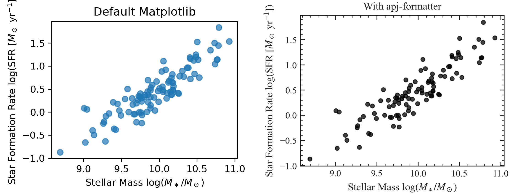

# apj-formatter

[](LICENSE)
[](https://www.python.org/downloads/)

Publication-ready `matplotlib` styling and formatting targeted for the **Astrophysical Journal (ApJ)** and other AAS Journals (ApJL, ApJS, AJ).

`apj-formatter` configures geometry, typography, inward ticks, and font embedding so your figures meet editorial and reproduction standards out of the box.

---

## Comparison: Default Matplotlib vs. apj-formatter



```python
import numpy as np
import matplotlib.pyplot as plt
import apj_formatter

x = np.random.normal(10.0, 0.5, 100)
y = 1.1 * x - 1.0 + np.random.normal(0, 0.25, 100)

# --- Default Matplotlib ---
fig_def, ax_def = plt.subplots(figsize=(3.5, 2.6))
ax_def.scatter(x, y, alpha=0.7)
ax_def.set_title("Default Matplotlib")
ax_def.set_xlabel(r"Stellar Mass $\log(M_\ast / M_\odot)$")
ax_def.set_ylabel(r"Star Formation Rate $\log(\mathrm{SFR})$")

# --- With apj-formatter ---
fig_apj, ax_apj = apj_formatter.subplots(1, 1, columns=1, aspect_ratio=2.6/3.5)
ax_apj.scatter(x, y, color="black", s=15, alpha=0.75)
ax_apj.set_title("With apj-formatter")
ax_apj.set_xlabel(r"Stellar Mass $\log(M_\ast / M_\odot)$")
ax_apj.set_ylabel(r"Star Formation Rate $\log(\mathrm{SFR})$")
apj_formatter.save_apj(fig_apj, "scatter_apj.pdf")
```

| Feature | Default Matplotlib | With `apj-formatter` |
| :--- | :--- | :--- |
| **Spine & Ticks** | 2 axes only, outward ticks, no minor ticks | All 4 axes, inward ticks, minor ticks enabled |
| **Typography** | Sans-serif, default mathtext | Times serif font stack, STIX mathtext / TeX |
| **Dimensions** | 6.4" × 4.8" default canvas | Exact 3.5" (1-col) or 7.1" (2-col) journal width |
| **Font Embedding** | Type 3 rasterized fonts possible | Type 42 TrueType embedded (passes AAS / arXiv checks) |

---

## Features

- **Accurate Journal Geometry**:
  - Single-column width: `3.5"` (88.9 mm / 252 pt)
  - Double-column width: `7.1"` (180.3 mm / 511 pt)
  - Configurable aspect ratio and width multipliers (`width_ratio`).
- **AAS/ApJ Tick & Spine Standards**:
  - Inward-pointing ticks on all four axes (`xtick.top=True`, `ytick.right=True`).
  - Minor ticks enabled by default on both axes with proportional sizing.
  - Crisp spine linewidth (`0.8 pt`).
- **Editorial Font Compliance (Type 42)**:
  - Configures `pdf.fonttype = 42` and `ps.fonttype = 42` (TrueType embedding) to pass arXiv and AAS editorial submission checks.
- **Robust Math Rendering**:
  - Uses Times-matched STIX mathtext fallback out-of-the-box — no external TeX installation required.
  - Seamlessly enables LaTeX rendering (`use_tex=True`) when LaTeX and font packages are available.
- **Non-Destructive Context Manager**:
  - Scoped styling via `with apj_formatter.style():` without polluting global matplotlib session state.

---

## Installation

### Using pip
```bash
pip install git+https://github.com/drtobybrown/apj-formatter.git
```

For local editable development:
```bash
git clone https://github.com/drtobybrown/apj-formatter.git ~/bin/apj_formatter
cd ~/bin/apj_formatter
pip install -e .
```

### Using uv
```bash
uv add git+https://github.com/drtobybrown/apj-formatter.git
# or into your active environment:
uv pip install -e .
```

---

## Quick Start

### 1. Single-Column Subplots
```python
import apj_formatter
import numpy as np
import matplotlib.pyplot as plt

x = np.linspace(0, 10, 200)
y = np.sin(x)

# Create 1-column figure (3.5" wide)
fig, ax = apj_formatter.subplots(1, 1, columns=1, aspect_ratio=0.7)

ax.plot(x, y, label=r"$\sin(x)$")
ax.set_xlabel(r"Rest Wavelength ($\mathrm{\AA}$)")
ax.set_ylabel(r"Normalized Flux ($F_\lambda / F_0$)")
ax.legend()

# Save with publication defaults (300 DPI, tight bounding box)
apj_formatter.save_apj(fig, "figure_1col.pdf")
```

### 2. Double-Column Multi-Panel Plot
```python
import apj_formatter
import numpy as np

# Create 2-column figure (7.1" wide)
fig, axes = apj_formatter.subplots(
    nrows=1, ncols=2,
    columns=2,
    aspect_ratio=0.45,
    sharey=True
)

axes[0].scatter(np.random.randn(100), np.random.randn(100), s=15, alpha=0.7)
axes[0].set_xlabel(r"$\Delta\mathrm{RA}$ (arcsec)")
axes[0].set_ylabel(r"$\Delta\mathrm{Dec}$ (arcsec)")

axes[1].hist(np.random.randn(500), bins=25, histtype="step", color="black")
axes[1].set_xlabel(r"Velocity Dispersion ($\mathrm{km\ s^{-1}}$)")

apj_formatter.save_apj(fig, "figure_2col.pdf")
```

### 3. Non-Destructive Context Manager
If you only want ApJ styling for specific figures in a notebook without affecting other plots:
```python
import matplotlib.pyplot as plt
import apj_formatter

with apj_formatter.style(columns=1, aspect_ratio=0.6) as (width, height):
    fig, ax = plt.subplots(figsize=(width, height))
    ax.plot([1, 2, 3], [4, 5, 6])
    ax.set_title("Scoped ApJ Figure")
    fig.savefig("scoped_figure.pdf", bbox_inches="tight")
```

### 4. Direct Figure Object
```python
import apj_formatter

# Single-column (3.5") or double-column (wide=True / columns=2)
fig = apj_formatter.figure(columns=1, aspect_ratio=0.75)
ax = fig.add_subplot(111)
ax.plot([1, 2, 3], [4, 5, 6])
```

---

## API Reference

- `apj_formatter.subplots(nrows=1, ncols=1, columns=1, wide=False, aspect_ratio=0.6, width_ratio=1.0, use_tex=False, **kwargs)`: Returns `(fig, ax)` configured with journal geometry and styles.
- `apj_formatter.figure(columns=1, wide=False, aspect_ratio=0.6, width_ratio=1.0, use_tex=False, **kwargs)`: Returns a styled `matplotlib.figure.Figure`.
- `apj_formatter.style(columns=1, aspect_ratio=0.6, ...)`: Context manager for scoped styling.
- `apj_formatter.set_style(columns=1, aspect_ratio=0.6, ...)`: Sets global `rcParams`.
- `apj_formatter.save_apj(fig, filename, dpi=300, ...)`: Saves vector PDF or high-resolution PNG with AAS publication settings.

---

## License

MIT License. See [LICENSE](LICENSE) for details.
